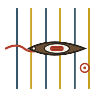

<p align="center">
  
</p>

<h1 align="center">shuttle</h1>

<p align="center">
  <em>🧵 The workflow engine of the quipu stack — every transition signed, every window frozen</em>
</p>

<p align="center">
  <a href="LICENSE"></a>
  <a href="https://github.com/scbrown/quipu"></a>
</p>

> *A shuttle carries the weft through the warp. Runs move through their
> workflow's declared steps; each pass leaves a signed knot in the record.*

Workflow engines usually mean a daemon, a queue, a server, and a dashboard
that disagrees with reality. Shuttle is none of those. A **local JSONL log is
the hot path**; [quipu](https://github.com/scbrown/quipu) is the governed
record. Runs move through their workflow's declared steps, every transition is
**signed by the agent that performed it** (per-agent ed25519), and the
append-only history is exported into quipu's time-windowed operational graphs —
where completed windows are **deep-frozen** whole into read-only archives that
stay queryable forever.

Consumers — [shantytown](https://github.com/scbrown/shantytown) crews,
[creel](https://github.com/scbrown/creel) tabs,
[NeuralAmplifier](https://github.com/scbrown/NeuralAmplifier) — read the
graph, never shuttle.

## Role in the stack

```text
  agents / crews                          (advance runs; each step signed)
        │
        ▼
    shuttle                               (state machine + JSONL outbox)
        │  export: signed Turtle, idempotent batches
        ▼
     quipu                                (windowed graphs · deep-frozen archives)
        │
        ▼
  shantytown · creel · NeuralAmplifier    (read the graph, never shuttle)
```

- **[camayoc](https://github.com/scbrown/camayoc)** owns the vocabulary:
  the workflow slice (`WorkflowRun`, `TransitionEvent`, …), each term owed to a
  competency question in `competency/workflow-and-archive.md`.
- **[caboodle](https://github.com/scbrown/caboodle)** installs and verifies
  shuttle as part of the box.

## Quick start

```bash
pip install -e .                       # Python 3.11+, one dep (cryptography)

shuttle keys init agent-a --workflow triage
#   -> prints the public key + registration Turtle; a HUMAN loads it into
#      the dataKind=identity graph. Shuttle never registers its own keys.

shuttle define examples/triage.json
shuttle start triage run-1 --agent agent-a
shuttle advance run-1 --step claim  --agent agent-a    # signed
shuttle advance run-1 --step work   --agent agent-a
shuttle advance run-1 --step finish --agent agent-a    # terminal
shuttle status

shuttle export                          # drain the log into quipu windows
shuttle verify run-1                    # re-verify signatures FROM the graph
shuttle freeze-window 2026-07           # archive a completed window
```

## The shape

| file | owns |
|---|---|
| `shuttle/model.py` | the pure state machine; events are the truth, state is a fold |
| `shuttle/state.py` | the append-only JSONL outbox + export watermark |
| `shuttle/signing.py` | per-agent ed25519 (0600 host files), `shuttle-transition-v1` canonical message |
| `shuttle/quipu_client.py` | windowed writes ride `/knot`'s STRICT `graph` lane; a SHACL refusal is a refusal, never a silent 200 |
| `shuttle/windows.py` | `{ns}/window/shuttle/runs/{YYYY-MM}` graphs + the `urn:shuttle:dataset:open` dataset |
| `shuttle/export.py` | log → signed Turtle → idempotent `/episode` batches |
| `shuttle/cli.py` | the whole v1 surface |

Design: [docs/design/shuttle.md](docs/design/shuttle.md).

## What runs today

v1 is landed: signed runs, windowed export, freezable history, and the
cross-repo acceptance passing against a live quipu. What it awaits is a first
production workload — the engine is built; the loom wants cloth.

```bash
just check    # parse + file-size ratchet
just test     # check + the unit suite
just e2e      # the cross-repo acceptance against a live quipu
```

## License

[MIT](LICENSE)
